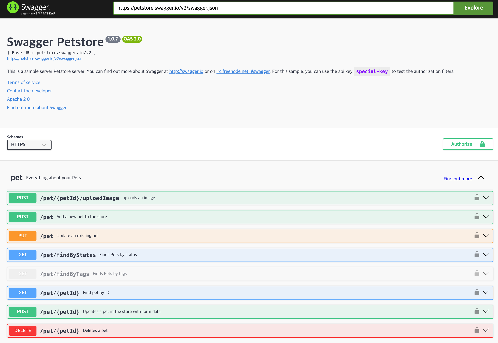
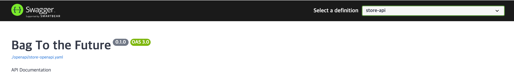
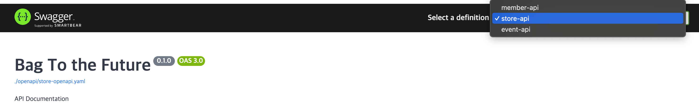

이번 프로젝트에 **Spring REST Docs + OAS**를 도입해본 후기 및 몇가지 팁 :)

<!-- truncate -->

## 필요성

앱개발자와 협업할때 API 문서화가 필요할 것이라 생각되어 Swagger를 쓰기로 했는데, 나의 제안으로 REST DOCS + OAS를 도입하게 되었다. 이 글을 보는 사람들에게 Spring REST Docs + OAS를 팔아보려고 한다.

### 신뢰성이 높다.

REST Docs로 문서를 만들면 반드시 테스트를 통과해야 결과물이 만들어지기 때문에 신뢰성이 높다. 강력한 장점이다.

만약 api 수정후 swagger 관련 어노테이션을 수정하지 않으면, 실제 api와 다른 문서가 만들어진다.

반면 REST Docs를 적용하면 api 테스트를 거쳐야만 문서가 완성되기 때문에, 프론트엔드 개발자나 외부 REST API를 사용하는 사람들에게 더 신뢰성 있는 문서를 전달할 수 있게 된다.

### 예쁘다.

Spring REST Docs를 사용하면, `adoc`파일 형식으로 api 결과물이 나온다. 졸업프로젝트에서, 이 REST Docs를 도입해 모든 api에 대한 테스트를 작성하고, 자동 문서화를 적용해 매우 뿌듯한 기억이 있었다.[(🔗링크)](https://2e2i.github.io/mamomo-server/) 하지만,, 정말 못생겼다.


게다가 인덱싱이나 링크 등 커스텀을 하려면 한땀한땀 수정해줘야 했다. 자동화는 맞는데.. 반 자동화다.

반면, Swagger를 사용하면 가독성이 매우 좋은 결과물을 만들 수 있다.
게다가 `Try it` 버튼으로 API 테스트까지 할 수 있어 프론트개발자에게도 매우 편리하다. JWT 토큰을 넣어 테스트 하거나, Request 정보를 수정해서 테스트도 가능하다.



큰 제목 아래 '.json'이나 '.yml'링크가 있는데, Swagger를 만든 원본 OpenAPI 스팩 파일이다. 이것을 다운로드 받아서 Postman으로 Import 할 수도 있다.👍

### 확장성이 좋다.

현재 멀티모듈 구조를 택해서, 모듈별로 `yml`파일이 생성된다. SwaggerUI를 활용하면 이를 통합할 수 있다.




이렇게 통합하는 기능도 제공한다. 이러한 기능은 Spring REST Docs 뿐만 아니라, 다른 백엔드 프레임워크의 문서화 결과물도 통합할 수 있게 해준다.

Swagger는 OpenAPI 스팩 기반으로 만들어진다.

- [Swagger OpenAPI Specification](https://swagger.io/specification/)
- [OpenAPI Specification 공식문서](https://spec.openapis.org/oas/v3.1.0)

그래서 OpenAPI 스팩에 맞는 `yml`, `json`파일만 만들면 Swagger로 예쁘게 문서화 할 수 있다. 그렇기 때문에 Spring, Django, nest.js를 혼합해서 쓰는 프로젝트에서도 양식에 맞는 파일만 만들면 API 문서를 통합할 수 있다.


(사진 출처: [https://velog.io/@letsdev](https://velog.io/@letsdev/MSA-Swagger-UI%EB%A1%9C-API-%EB%AC%B8%EC%84%9C-%ED%86%B5%ED%95%A9-%ED%94%84%EB%A1%9C%EC%84%B8%EC%8A%A4-3-Gradle-Task-from-ePages-Plugin))

## Spring REST Docs에 OAS 적용하기

Spring REST Docs에 [restdocs-api-spec](https://github.com/ePages-de/restdocs-api-spec) 라이브러리를 얹으면 된다.

### dependency 추가 및 gradle task 세팅

```gradle
plugins {
    id 'com.epages.restdocs-api-spec' version '0.19.1'
}

openapi3 {
    server = '서버 주소'
    title = '제목'
    description = '설명'
    version = '0.1.0(버전)'
    outputFileNamePrefix = '파일명'
    format = 'yaml or json'
}
```

### 테스트 코드 작성

기존 REST Docs 코드에

```java
- import static org.springframework.restdocs.mockmvc.MockMvcRestDocumentation.document;
+ import static com.epages.restdocs.apispec.MockMvcRestDocumentationWrapper.document;
```

`MockMvcRestDocumentation`를 `MockMvcRestDocumentationWrapper`로 대체하면 된다.

### 결과물 생성

OpenAPI 3.0.1 specification 으로 문서를 만드려면 다음과 같은 명령어로 yaml 혹은 json 파일을 만든다.

```bash
./gradlew openapi3
```

build 디렉토리가 없으면 오류가 나기 때문에 빌드 돌린 후 진행하면 된다.

/build/api-spec/에 yaml 파일이 생긴것을 확인할 수 있다.


IntelliJ 사용시 OAS 스팩을 UI로 바로 확인할 수도 있다.

## MSA에서 api 문서 통합해 Swagger 적용하기

### 흩어져 있는 yaml파일 통합

```gradle
task copyOpenApiSpecsToDocsDir(type: Copy) {
	dependsOn ':api:member:openapi3'
	dependsOn ':api:store:makeOpenapi'
	dependsOn ':api:event:openapi3'

	// member
	from "${project(':api:member').buildDir}/api-spec/member-openapi.yaml"
	into "${project.rootDir}/docs/openapi"

	// product
	from "${project(':api:store').buildDir}/api-spec/store-openapi.yaml"
	into "${project.rootDir}/docs/openapi"

	//event
	from "${project(':api:event').buildDir}/api-spec/event-openapi.yaml"
	into "${project.rootDir}/docs/openapi"
}
```

위 스크립트를 작성해 각 api 모듈의 빌드 디렉토리에서, 루트의 /docs로 결과물을 복사하는 task를 생성했다.

```
├── docs
│   ├── Dockerfile
│   ├── index.html
│   ├── openapi
│   │   ├── event-openapi.yaml
│   │   ├── member-openapi.yaml
│   │   └── store-openapi.yaml
│   └── urls.json
```

`copyOpenApiSpecsToDocsDir`를 실행하면, /docs/openapi로 파일들이 모이게 된다.

### Swagger 적용하기

spring에서 정적 리소스를 호스팅하고 이 주소로 docker swagger 이미지를 사용해 띄우는 방법도 있지만, 서버가 가동중이 아닐때도 확인 할 수 있게 세팅하고 싶었다.

간단하게 Swagger의 `index.html` 만 가져와 standalone 모드로 세팅했다.

먼저 전체 소스코드이다. [Swagger UI Installation](https://swagger.io/docs/open-source-tools/swagger-ui/usage/installation/) 참고해서 base html을 가져왔고, 조금 수정했다.

**📄 index.html 전체 소스코드**

```html
<!DOCTYPE html>
<html lang="en">
  <head>
    <meta charset="utf-8" />
    <meta name="viewport" content="width=device-width, initial-scale=1" />
    <meta name="description" content="SwaggerUI" />
    <title>백투더퓨처 API Docs</title>
    <link
      rel="stylesheet"
      href="https://unpkg.com/swagger-ui-dist@5.11.8/swagger-ui.css"
    />
  </head>
  <body>
    <div id="swagger-ui"></div>
    <script
      src="https://unpkg.com/swagger-ui-dist@5.11.8/swagger-ui-bundle.js"
      crossorigin
    ></script>
    <script
      src="https://unpkg.com/swagger-ui-dist@5.11.8/swagger-ui-standalone-preset.js"
      crossorigin
    ></script>
    <script src="https://unpkg.com/axios/dist/axios.min.js"></script>
    <script>
      window.onload = () => {
        axios.get("urls.json").then((res) => {
          const urls = res.data;
          window.ui = SwaggerUIBundle({
            urls: urls,
            dom_id: "#swagger-ui",
            presets: [SwaggerUIBundle.presets.apis, SwaggerUIStandalonePreset],
            layout: "StandaloneLayout",
            queryConfigEnabled: true,
          });
        });
      };
    </script>
  </body>
</html>
```

바꾼 부분은 다음과 같다.

```js
axios.get("urls.json").then((res) => {
    const urls = res.data;
    window.ui = SwaggerUIBundle({
        urls: urls,
        // 생략
```

여러 yaml 파일들을 통합하기 위해서 json파일로 목록을 작성해 index.html에서 불러올 수 있도록 했다. `url.json`은 아래처럼 생겼다.

**📄 url.json**

```json
[
  { "url": "./openapi/member-openapi.yaml", "name": "member-api" },
  { "url": "./openapi/store-openapi.yaml", "name": "store-api" },
  { "url": "./openapi/event-openapi.yaml", "name": "event-api" }
]
```

url과 ui상에서 보여질 name을 설정한다.

### Swagger 결과물을 Docker 이미지로 만들기

단순하게 index.html만 띄우면 되어서, nginx이미지를 사용했다. 아래는 Dockerfile 내용이다.

```Dockerfile
FROM nginx:alpine
COPY . /usr/share/nginx/html/
```

이렇게 해서 이미지를 빌드하고 아래처럼 (docker compose 일부) 설정하면 내가 정한 포트로 접근했을때, Swagger UI를 확인할 수 있다.

```yaml
swagger-ui:
  image: bagtothefuture-swagger:latest # swagger 이미지
  ports:
    - "8000:80" # 80포트를 host의 8000로 오픈
```

## JWT 토큰 적용하기

`requestHedaer()`로 작성하면 헤더 입력칸이 생기지만, Try it으로 테스트시 실제로 보내지지 않는다. 거의 모든 API가 JWT 토큰을 사용하는데, 이걸 적용하지 못한다면 Swagger를 적용하는 큰 이유가 하나 사라진다..

epages에서 뒤져보았는데 아직 찾지 못했다 흠..

그러던 참에 [hwsa1004님의 블로그 글](https://velog.io/@hwsa1004/Spring-restdocs-swagger-%EA%B0%99%EC%9D%B4-%EC%82%AC%EC%9A%A9%ED%95%98%EA%B8%B0)을 발견해 적용해 보았다.

```gradle
task makeOpenapi {
    dependsOn 'openapi3'
    doFirst {
        def swaggerUIFile = file("${openapi3.outputDirectory}/store-openapi.yaml")

        def securitySchemesContent =  "  securitySchemes:\n" +  \
                                      "    bearerAuth:\n" +  \
                                      "      type: http\n" +  \
                                      "      scheme: bearer\n" +  \
                                      "      bearerFormat: JWT\n" + \
                                      "security:\n" +
                "  - bearerAuth: []"

        swaggerUIFile.append securitySchemesContent
    }
}
```

직접 이부분을 문서 마지막에 추가해주는 것이다.

블로그와 다른 점은, [openapi3 docs](https://swagger.io/docs/specification/authentication/bearer-authentication/)를 참고해, bearer 타입으로 넣은 것이다.

이렇게 적용하면 "Bearer "을 포함하지 않고 토큰만 입력해도 된다.


토큰을 입력하고, Authorize 버튼을 누르면 이후에 api 테스트에서 header에 토큰을 입력하지 않아도 보내지게 된다.

## 마무리

프로젝트를 진행하며 Spring REST Docs + OAS를 적용해보았고, 장점이 너무나 많다고 생각되어 글을 작성하게 되었다. 하면서 공유할 팁이 더 생긴다면 내용을 추가 할 것이다.

> 한 번 써보세요!! 장점이 많습니다 :)
