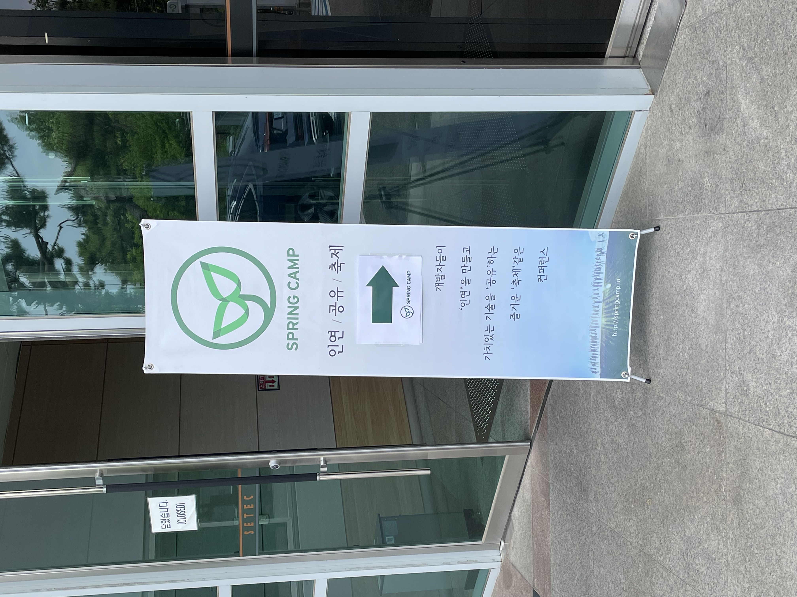
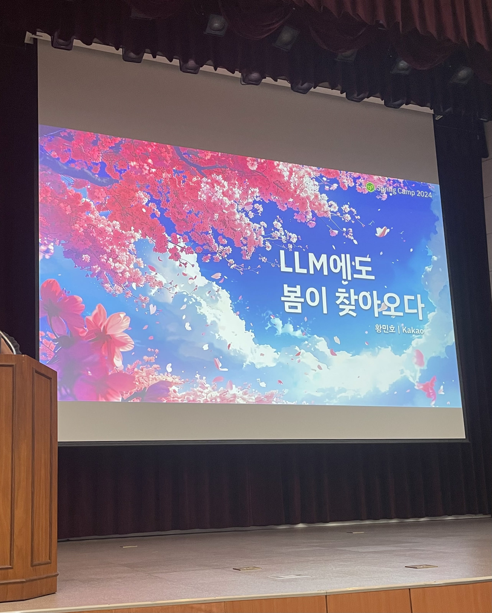
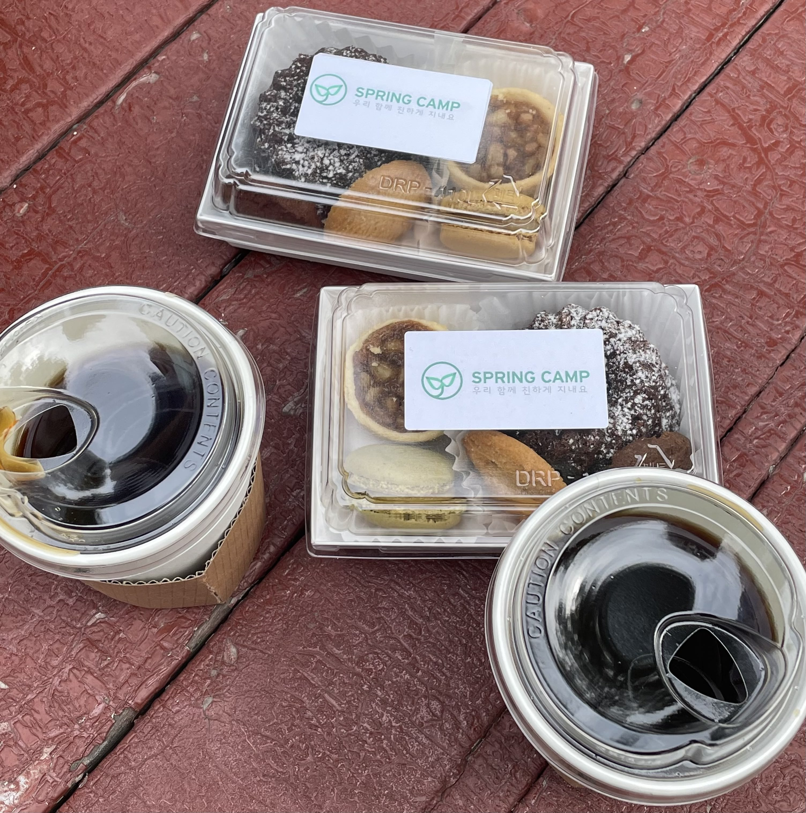

[2024 스프링캠프](https://springcamp.ksug.org/2024/)에 다녀왔다!

<!-- truncate -->

## 치열했던 티켓팅

핸드폰으로 시도했는데 다행히 성공했다. 1분도 안되어 매진되었다고 한다.

## 현장 사진 및 굿즈 수령

현대자동차, 카카오뱅크 부스가 있어 빨대&칫솔 세트와 수건을 받았다. 스프링캠프 주최측에선 손풍기를 주셨다. 이번 여름에 안그래도 사려고 했던 터라 마음에 쏙 들었고, 무엇보다 가장 좋았던건 키캡..!!! 키보드 덕후로서 키캡 굿즈라니 이건 최고야.. 스티커도 야무지게 챙겨왔다 ㅎㅎ

다들 서로 인사하고 하시던데 나만 친구가 없어서 약간 슬펐다.. 2024 하반기에는 커뮤니티 활동을 할 수 있는 기회가 있으면 좋겠다. 개발바닥이나 유쾌한 스프링 방 같은 오픈채팅도 들어가 있는데, 인싸력을 좀 더 키울 필요가 있겠다.

## 타임 테이블

| Track 1       |                                                                   |        |
| ------------- | ----------------------------------------------------------------- | ------ |
| 12:00 ~ 13:00 | 접수 / 등록                                                       |        |
| 13:00 ~ 13:45 | Tidy First                                                        | 안영회 |
| 14:00 ~ 14:45 | Spring AI : LLM에도 봄이 찾아오다.                                | 황민호 |
| 14:45 ~ 15:15 | Coffee Break                                                      |        |
| 15:15 ~ 16:00 | 왜 나는 테스트를 작성하기 싫을까?                                 | 조성아 |
| 16:15 ~ 17:00 | 실전! MSA 개발 가이드                                             | 김용욱 |
| 17:15 ~ 18:00 | 구해줘 홈즈! 은행에서 3천만 트래픽의 홈 서비스 새로 만들기 | 이영규 |

| Track 2       |                                                                   |        |
| ------------- | ----------------------------------------------------------------- | ------ |
| 12:00 ~ 13:00 | 접수 / 등록                                                       |        |
| 13:00 ~ 13:45 | 동시성의 미래 - 코루틴의 버츄얼 스레드                            | 이상훈 |
| 14:00 ~ 14:45 | Spring Coroutine In Action                                        | 최진영 |
| 14:45 ~ 15:15 | Coffee Break                                                      |        |
| 15:15 ~ 16:00 | 스프링 R2DBC 연동 기능을 활용한 작은 코틀린 SQL DSL 개발기 | 오현석 |
| 16:15 ~ 17:00 | 데이터를 스케치 하기                                              | 황영   |
| 17:15 ~ 18:00 | AutoParams를 사용한 Spring Boot 응용프로그램 테스트        | 이규원 |

두 트랙으로 나뉘어서 진행되었다. 해당 시간에 원하는 세션을 선택해서 들을 수 있었는데, 아직 코틀린으로 스프링을 다루어 본 적은 없어서 Track1 세션으로 쭉 들었다.

## 🌱 Tidy First?

TDD, 리팩토링의 저자로 유명한 켄트 백의 신간인 _Tidy First?_ 의 역자이신 안영회님의 세션이였다.

Tidy는 한국말로 하면 '코드 정리' 쯤으로 번역할 수 있다. 이 책은 총 3권 시리즈로 구성되어 있고, Tidy First?는 이중 첫번째 책이다. 두번째 책은 _Tidy Together_ 로 나올 가능성이 크다고 한다.

사실 소프트웨어 개발이란 요구사항에 맞는 결과물이 올바르게 나오기만 하면 되지만, 한번 만들고 끝이 아니라, 유지보수를 계속 해야한다. 따라서 변경에 용이한 코드를 짜는 것이 중요하다. 이 과정에서 필요한게 **Tidy**이고, 이것을 **왜** 해야 하는지, **언제** 해야 하는지, **어떻게** 해야 하는지에 대해 다루는 책이다.

이 책의 설명에 안영회님이 소프트웨어 개발에 대해 생각하는 바를 엿볼 수 있었는데

> 소프트웨어 개발이란 '유기체'와 유사하다. "요소를 유익하게 관계맺는 일" 이다.

이 문장이 인상깊었던 것 같다. 생물과 유사하게 소프트웨어도 쪼개면 작은 단위로 이루어져 있고, 그것들이 상호작용 해 하나의 시스템을 만들어 내기 때문이다.

짧은 경력을 갖고 있는 나지만,, 강연 내용에는 공감할 수 있는 내용이 아주 많았다. 코드는 완벽할 수 없고, 때론 급하게 작성하기도 하는데 이걸 언젠간 정리해야 한다. 미루면 미룰수록 하기 힘들어지고, 처음부터 잘 해놓는게 가장 베스트이다. 코드를 정리하는 방법론을 공부해서 적용해보면 더 좋을 것 같다.

책이 코드를 타이핑하면서 따라할 수 있게끔 구성되어 있다고 하는데, 스터디를 구성해서 완주를 한번 해보고 싶다.

## 🌱 Spring AI : LLM에도 봄이 찾아오다.

카카오의 황민호님 세션이였다. LLM의 발전 과정과 Spring AI를 활용하는 방법에 대해 강연해주셨다. SpringAI의 특징을 간략하게 정리하면

- 주요 AI Provider 통합
  - OpenAI, 마이크로소프트 Asure, 아마존, 구글 등 지원
  - 채팅, 텍스트-이미지 변환 모델 유형 지원
  - 동기식 및 스트림 지원
- 주요 벡터DB 지원
- AI 개발 편의
  - AI 모델 출력을 POJO로 매핑
  - Function Calling 지원
  - AI용 SpringBoot Starter 지원

정도가 있겠다. 지금 v.0점대 개발이 진행중이고 올해 하반기쯤 v1.0이 나온다고 한다. 나 또한 ChatGPT와 코파일럿을 정말 유용하게 쓰고 있다. AI가 정말 빠르게 발전하고 있다고 느껴진다. 개발자로서도 무시할 수 없는 흐름인 것 같다. 이러한 프레임워크를 이용해 AI를 사용 할 수 있는 능력을 갖춘 개발자도 곧 수요가 점점 늘어날 것 같다. 실제로 그런 것 같기도 하다.

보안적으로 국내 최고 예민한 우리회사도 최근 마이크로소프트 코파일럿을 이용할 수 있게 해주었다. IT분야가 AI시대를 맞으며 빠르게 변화하고 있다.

나도 다음 사이드 프로젝트는 AI를 활용한 프로젝트를 해보아야 겠다. ~~돈만 문제가 안된다면~~

## ☕️ Coffee Break

달다구리와 커피(또는 오렌지주스) 나눠주셔서 기력 충전했다 👍

## 왜 나는 테스트를 작성하기 싫을까?

네이버 플라즈마팀의 조성아님 세션이였다. 테스트를 작성하는 자세에 대한 이야기였고, 오픈소스인 [🐵 FixtureMonkey](https://naver.github.io/fixture-monkey/v1-0-0/)개발기와 사용 팁도 전달해주셨다.

픽스쳐몽키는 들어본 적이 있긴 한데, 테스트 라이브러리라고만 알고있고 용도는 몰랐다. 테스트에 필요한 객체들을 쉽게 생성해주는 라이브러리라고 한다. 테스트를 작성한 경험이 많지는 않지만, REST Docs로 테스트 작성할때, 필요한 오브젝트들을 생성자나 빌더로 생성해주는 과정은 꽤.. 귀찮긴 했다. 이러한 과정을 줄여줄 수 있다니 적극 검토해보아야 겠다는 생각을 했다.

테스트를 작성하면 안전성을 높여 신뢰성 있는 프로그램을 만들 수 있다. 하지만 테스트를 작성하는데에도 비용이 든다. 가장 큰 문제점은 요구사항이 추가되고 변경될때 테스트도 같이 수정이 필요하다는 것이다. 기능 하나 추가하고 필드 하나 추가했는데 몇백개의 테스트를 수정해야 한다면...? 끔찍하다.

이러한 트레이드오프를 고민한 경험에 대해 풀어주셨다. 이런 저런 실패를 경험하고 시행착오를 겪으며 테스트에 대해 나름의 정의를 한 과정을 공유해주셨다.

> 모든 테스트 케이스, 엣지 케이스를 모두 테스트 하려고 하기보단 동작 여부 검증에 집중하자.

테스트를 작성하는 것은 중요하지만, 지속 가능한 테스트를 작성하는것이 가장 중요하다! 는 메시지였다.

테스트의 필요성은 뼈저리게 느끼고 있다. 회사에서 SpringBoot로 된 부분은 한번 시작하면 타고타고 들어가 동작하는.. 마치 절차지향처럼 되어있다. 여기서 하나 수정하려고 하면 자신이 일단 없다. 수정을 해서 원래 동작했던 기능이 잘 될지 알 수가 없다. 심지어 리눅스에서만 동작하고, 정해진 폴더 구조에서만 동작하기 때문에 윈도우 IDE에서조차 돌릴 수 없다. 기능 하나 수정하면 길게는 40분.. 동안 코드를 실행해보고 로그를 통해서 디버깅 해야 하는 상황이다. 저번에 리팩토링 한다고 코드를 대거 수정한 적이 있었는데, 하루에 9/10 정도를 실행해서 결과보는 시간에 써야 했다. 테스트가 있었다면, 테스트가 가능한 환경을 염두에 두고 작성되었다면 이런 일이 없었을거다. 진짜 너무 힘들다..

하지만 이미 완성된 시스템에서 테스트를 추가하기란 쉽지 않다. 테스트를 고려하지 않고 짜여졌기 때문에, 유닛테스트와 같은 작은 단위의 테스트는 매우 힘들다. Q&A에서 이것에 대한 힌트를 얻을 수 있었는데, 분리 가능한것을 분리하고 이것부터 테스트 하는 방법이다. 테스트 코드가 없지만, 나부터 일단 실천하고 테스트의 장점을 행동으로 입증해야겠다는 생각을 했다. 이번에 추가되는 기능은 꼭. 테스트 작성하면서 해보려고 한다.

일단 테스트 작성법부터 공부해야 할 것 같다. 테스트를 잘 하는 사람이 비지니스 코드도 잘 짜게 될 수 있을것 같다는 생각이 든다. 작은 단위의 테스트가 가능하다는 것은 결합도가 낮다는 뜻이기 때문이다. 여러모로 느끼는 것이 많았던 세션이다.

추가로 불편한 점을 개선하려고 오픈소스까지 개발하는 모습이 정말 멋있었다. 오픈소스 메인테이너라니 내 워너비다.

## 실전! MSA 개발 가이드

삼성 SDS의 김용욱님의 강연이였다. 사내에서 MSA 컨설턴트와 개발을 하고 계신다고 한다. 이번 스프링캠프 강연중에서도 정말 인상깊었던 시간이였다.

간단하게 정리해보면 다음과 같다.

+++

MSA를 도입하려면 다음 두가지가 걱정이 된다.
- API로 속도가 괜찮을까?
- 트랜잭션 보장 없이 정합성이 맞을까?

**📌 API로 속도가 괜찮을까?**

MSA로 시스템을 구성하게 되면 각 서비스는 API를 통해 통신하게 된다. 네트워크를 타기 때문에 속도에 대한 우려가 있기 마련이다. 이를 해결하는 방법은 이런 것들이 있다.

1. 데이터 복제
    - 필요한 속성을 미리 복사해두고, 배치 등으로 sync를 맞춘다.
    - 이때 주의할 것은 몽땅 복사하면 안된다는 것이다. DB Table로 치면, 몇개 필요한 속성만 복사해둔다.
2. 모델링 변경
    - 설계할때 예를들어 '고객'과 '상담'테이블이 있다면, 해당 데이터가 '고객'과 관련된 데이터이고, 설계상 고객서비스와 같이있는 것이 원래의 그림일때 만약 '상담' 서비스에서 자주 참조하는 것이라면 고객정보지만 상담 서비스쪽에 데이터를 두는것이다. 이렇게 되면 서비스간 통신을 하지 않고도 해결할 수 있다.
3. 일괄 조회
    - 200개를 조회한다고 치면, REST API 200개가 나가는 것이 아니라, 한번에 조회할 수 있게 해야 한다.
    - REST API의 N+1 Problem 문제가 있다.
4. 병렬 조회
    - 순간적으로 큰 부하가 생길 수 있어 대부분의 경우 안티패턴이다.
5. 로컬 캐시
    - 공통코드와 같이 변경이 적지만 자주 조회해야 하는 경우, 로컬캐시에 올려두고 사용한다.
    - Redis는 느리다.
    - 로컬캐시는 동기화 하지 않는 것을 전제로 한다.
      - 서비스가 여러개일때 이를 동기화 할 수 없다.
      - 동기화 하는 것은 안티패턴이다.

**📌 트랜잭션 보장 없이 정합성이 맞을까?**

서비스가 나뉘어져 있기 때문에 하나의 기능에서 한번의 트랜잭션으로 동작을 모두 수행할 수 없다.

- MSA 구조의 경우 전체 과정에 대한 롤백이 불가능하다.
- 롤백 대신 실패시 삭제하는 API가 필요하다.
- 그럼 삭제하다가 실패하면 어쩌냐?
    - 대사작업이 필요할 수 있다는것을 인지해둔다. (ex. 배치)
- API가 실패했을때 바로 재시도 하는것은 대부분 안티패턴이다.
    - 해당 서비스가 회복할 시간을 주어야 한다.
    - 그런데 이벤트 방식은 괜찮다!
        - 이벤트로 재시도 하는 것은 해당 서비스가 가능할때 큐 등에서 끌어다 쓰는 것이라 괜찮다.
    - 그리고 실패라고 응답받았는데, 사실 성공했을 수도 있다는 것을 알아야 한다.
        - 이렇게 되면 두번 수행하게 된다.
        - 따라서 멱등성이 보장되어야 한다.
- 언제 이벤트로 분리하는가?
    - 실패해도 전체 취소가 없다면 이벤트로 분리한다.

+++

하나하나 다 도움되고 공부할 수 있는 내용이라 열심히 적어본 세션이였다. 회사 프로젝트의 경우 MSA를 도입하기엔 사람도 없고, 작아서 당분간은 실무에서 경험 해볼 수 없는 점이 아쉽다.. 언젠가 개발할 때를 대비해 미리미리 공부해 두어야 겠다. MSA라는 개념이 멀게 느껴졌는데, 이번 세션을 들으면서 윤곽이 좀 보였던 것 같다. MSA를 적용한다는 것은 어떤 것이고, 주의할 점은 무엇인지 조금은 알 것 같다. 매우매우 좋았던 강연이였다!

## 구해줘 홈즈! 은행에서 3천만 트래픽의 홈 서비스 새로 만들기

카카오뱅크 홈서비스개발팀의 이영규님의 발표였다. 은행에서 홈 서비스의 분리 여정을 소개하는 내용이였다.

기술 부채로 해결하는 문제는 두가지 였다고 한다.

- 구조적 문제
- 성능적 문제

**📌 구조적 문제 - 핵사고날 아키텍처**

구조적 문제는 핵사고날 아키텍처를 적용해 풀었다고 한다. 요즘 정말 자주 들리는 단어인데, 아직 여기까지는 공부하지 못했다.🥲 도메인계층을 보호할 수 있는 아키텍처라고 한다. 개념을 잘 알지는 못해 아주 와닿진 않았지만, 어떤 것이 장점인지를 알게되어서 궁금하다는 생각이 커졌다. 공부할거 빨리 다 끝내고 아키텍처쪽도 파보고 싶다..

**📌 성능적 문제 - 코루틴 적용**

세가지가 고려 대상이였다고 한다.

- Spring @Async
- Spring Webflux
- 코루틴

코루틴을 채택하면서 Java에서 코틀린으로의 포팅작업도 이루어졌다고 한다. 코루틴은 나도 안드로이드 공부할때 접한 적이 있는데,, 제대로 사용해본 적은 없다. 멀티스레드를 다루기 좋다(?) 정도로만 알고 있었다. 요즘 코프링으로 개발하는사람이 부쩍 많아진 것 같고, 현업에서도 많이 쓰이는 듯 해보인다. 일단 자바를 정복하고,, 코틀린으로도 해보고 싶다.

**📌 이관시 안정성 확보**

좀 많이 새로웠던 부분이 이부분이였는데, 거의 새로운 프로젝트로 옮기면서, 그 전에 수행했던 기능이 잘 동작하는것을 검증하는것이 가장 중요했다고 한다. 그러면서 적용한 방법을 몇가지 소개해주셨는데, 아주 새로웠다.

- 응답 비교 서비스
    - 기존 서비스와 신규 서비스에 동일한 요청에서, 동일한 응답이 오는지 검증하는 서비스를 따로 만들었다고 한다.
    - 조회 위주의 서비스라 가능한 듯 했다.
    - 기존 서비스와 신규 서비스의 응답이 일치하지 않을 때, alert를 주면 로그를 확인해보는 방식으로 진행했다고 한다.
- 표본 검사
    - 모든 서비스를 비교하고 검증하기 힘들어서 작은 비율부터 점점 늘려나갔다고 한다.
- A/B 트래픽 분산
    - A/B 테스트를 하듯이 신규 서비스 / 기존 서비스로 트래픽을 분산시켰다고 한다.
    - 비율은 설정등으로 유동적으로 변경할 수 있게 구성해서, 문제상황에서도 대처 가능하게끔 구성했다고 한다.

이 세션에서 이관에 대한 내용이 가장 새로웠다. 이런 방법을 생각해볼 수도 있구나. 놀랐었다.

## 마무리

생각보다 엄청 타이트하게 진행되었다. 내년에 또 갈 수 있게 되면 밥 든든히 먹고,, 커피도 충분히 마시고 참여해야겠다고 생각했다 ㅋㅋ

참가하길 정말정말 잘했다고 생각이 들었다. 지금 들은 내용을 바로 흡수해서 실천하긴 어렵겠지만, 개발에 대한 나의 인사이트를 정말 넓게 확장시켜 줄 수 있는 좋은 기회였다고 생각한다. 온라인으로도 이런 자료들을 충분히 많이 접할 수 있지만 현장에서 듣는 것은 와닿는 정도가 다르다고 느꼈다.

오프라인 행사 참여는 처음이였는데 너무 좋았던 기억밖에 없어서, 다른 좋은 참여 기회가 또 있다면 적극적으로 참여할 생각이다.

오늘에 대한 감상이 다 날아가기전에 급하게 후다닥 적어보았다. 2025 스프링 캠프를 고민하신다면 꼭 참가해보시라고 권하고 싶다😚

 